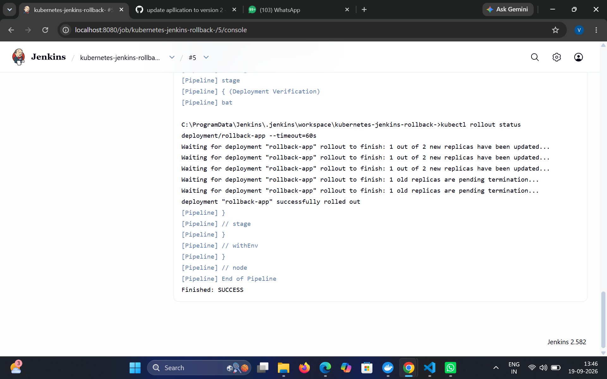
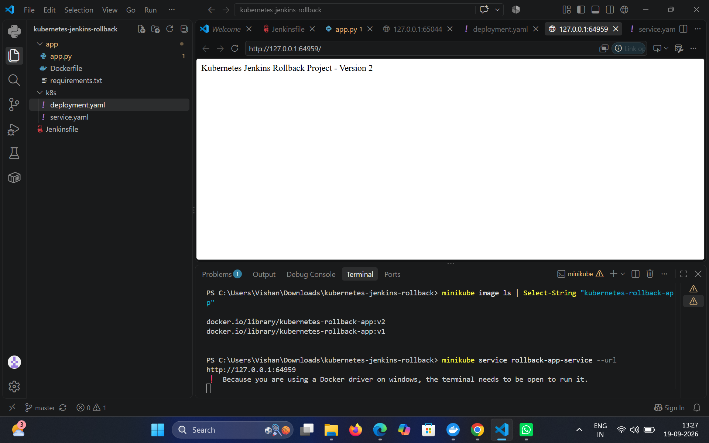
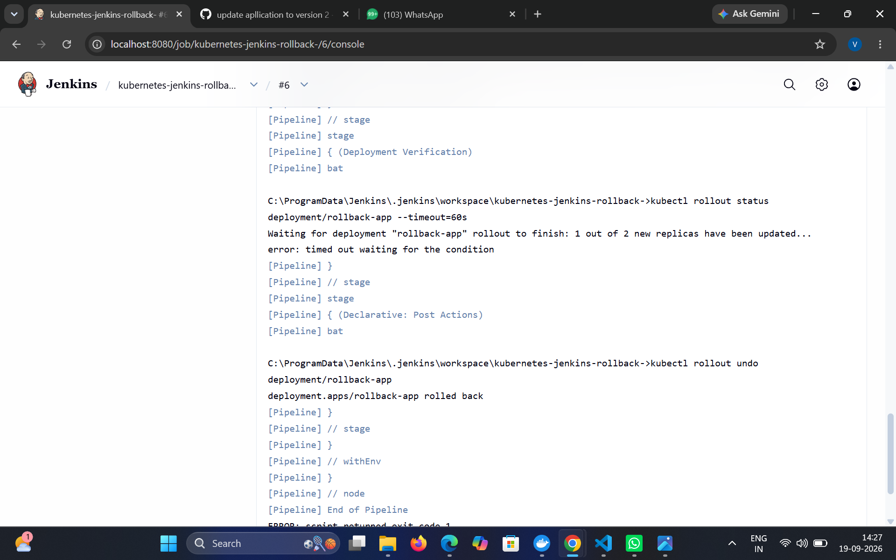

Automated Application Deployment and Rollback System using Jenkins and Kubernetes

📌 Project Overview

This project implements an automated CI/CD deployment and rollback system using Jenkins, Docker, and Kubernetes.

The system automatically builds the application, creates a Docker image, deploys the application to Kubernetes, verifies the deployment, and automatically rolls back to the previous working version if the new deployment fails.

The project demonstrates how DevOps automation can reduce manual deployment effort and improve application reliability.

---

🎯 Problem Statement

In a traditional deployment process, applications are often deployed manually. If a newly deployed version contains an error, recovering the previous working version can require manual intervention and may cause application downtime.

This project solves the problem by automating:

- Application deployment
- Docker image creation
- Kubernetes deployment
- Deployment verification
- Automatic rollback after deployment failure

---

🎯 Objectives

- Automate application deployment using Jenkins.
- Containerize the application using Docker.
- Deploy the application using Kubernetes.
- Verify whether the new deployment is healthy.
- Automatically rollback a failed deployment.
- Maintain the previous working application version.

---

🏗️ Architecture

Developer
    │
    ▼
  GitHub
    │
    ▼
  Jenkins
    │
    ├── Checkout Source Code
    │
    ├── Build Docker Image
    │
    ├── Deploy to Kubernetes
    │
    └── Verify Deployment
             │
       ┌─────┴─────┐
       │            │
    SUCCESS      FAILURE
       │            │
       ▼            ▼
 New Version    Jenkins executes
 Running        kubectl rollout undo
                    │
                    ▼
             Previous Version
                Restored
                    │
                    ▼
              Kubernetes
                    │
                    ▼
                 Service
                    │
                    ▼
               Application

---

🛠️ Technologies Used

Technology| Purpose
Python| Application development
Flask| Web application framework
Docker| Application containerization
Kubernetes| Container orchestration
Minikube| Local Kubernetes cluster
Jenkins| CI/CD automation
Git| Version control
GitHub| Source code management
kubectl| Kubernetes command-line management

---

📂 Project Structure

kubernetes-jenkins-rollback/
│
├── app/
│   ├── app.py
│   ├── requirements.txt
│   └── Dockerfile
│
├── k8s/
│   ├── deployment.yaml
│   └── service.yaml
│
└── Jenkinsfile

---

⚙️ Application

The application is developed using Python Flask.

The application provides a simple endpoint that displays the deployed application version.

Example:

Kubernetes Jenkins Rollback Project - Version 2

---

🐳 Docker

The Flask application is packaged into a Docker image.

Example Docker image:

kubernetes-rollback-app:v2

Docker provides a consistent environment for running the application inside Kubernetes.

---

☸️ Kubernetes Deployment

The application is deployed using a Kubernetes Deployment.

The Deployment manages multiple application Pods and ensures the required number of replicas are running.

The project uses:

2 replicas

Each Pod runs the Flask application container.

A Kubernetes Service exposes the application to the user.

---

🔄 CI/CD Pipeline

The Jenkins pipeline performs the following operations:

1. Checkout

Jenkins retrieves the latest source code from GitHub.

2. Build Docker Image

Jenkins builds the Docker image:

kubernetes-rollback-app:v2

3. Deploy to Kubernetes

Jenkins applies the Kubernetes configuration:

kubectl apply -f k8s/deployment.yaml
kubectl apply -f k8s/service.yaml

4. Deployment Verification

Jenkins checks whether the deployment completes successfully:

kubectl rollout status deployment/rollback-app --timeout=60s

5. Automatic Rollback

If the deployment fails, Jenkins executes:

kubectl rollout undo deployment/rollback-app

This restores the previous working version.

---

🔙 Rollback Demonstration

The rollback mechanism was tested using an intentionally unhealthy deployment configuration.

Working Version

Version 2 was successfully deployed:

Kubernetes Jenkins Rollback Project - Version 2

Failed Deployment

A deployment health-check path was intentionally changed to an invalid path.

Kubernetes could not mark the new Pods as ready.

Jenkins detected the failed rollout.

Automatic Recovery

Jenkins automatically executed:

kubectl rollout undo deployment/rollback-app

Kubernetes restored the previous working version.

The application was then verified again and Version 2 was available.

---

🔍 Kubernetes Health Check

The application uses a Kubernetes readiness probe:

readinessProbe:
  httpGet:
    path: /
    port: 5000
  initialDelaySeconds: 5
  periodSeconds: 5

The readiness probe allows Kubernetes to determine whether the application is ready to receive traffic.

---

🚀 How to Run the Project

Prerequisites

Install:

- Git
- Docker Desktop
- Kubernetes
- Minikube
- kubectl
- Jenkins

Start Minikube

minikube start

Build the Docker Image

docker build -t kubernetes-rollback-app:v2 ./app

Load the Image into Minikube

minikube image load kubernetes-rollback-app:v2

Deploy Kubernetes Resources

kubectl apply -f k8s/deployment.yaml
kubectl apply -f k8s/service.yaml

Check Pods

kubectl get pods

Check Deployment

kubectl get deployment

Open Application

minikube service rollback-app-service --url

---

🔐 Security Considerations

- Kubernetes configuration is maintained separately from application source code.
- Jenkins credentials should be stored using Jenkins Credentials Manager rather than hard-coded.
- Container images should be scanned for vulnerabilities in a production environment.
- Kubernetes access should follow the principle of least privilege.
- Sensitive configuration and secrets should not be committed to GitHub.

---

📸 Project Screenshots

Jenkins Successful Deployment

Application Version 2

Jenkins Automatic Rollback

Kubernetes Pods,deplyment

---

⭐ Key Features

- Automated CI/CD pipeline
- Docker containerization
- Kubernetes deployment
- Multiple application replicas
- Deployment health verification
- Automatic rollback
- GitHub integration
- Jenkins automation
- Local Kubernetes testing using Minikube

---

📈 Future Enhancements

- Push images to a container registry such as Docker Hub or Amazon ECR.
- Deploy the application to AWS EKS.
- Add automated security scanning.
- Add application monitoring and logging.
- Add Slack or email deployment notifications.
- Implement blue-green or canary deployment strategies.

---

💡 What This Project Demonstrates

This project demonstrates practical knowledge of:

Git
GitHub
   ↓
Jenkins
   ↓
Docker
   ↓
Kubernetes
   ↓
Deployment
   ↓
Health Check
   ↓
Automatic Rollback

It demonstrates how CI/CD automation and Kubernetes can be used together to deploy applications and recover automatically from failed deployments.

---

👨‍💻 Author

  Vishan Sree A

Bachelor of Engineering – Computer Science and Engineering
AWS & DevOps